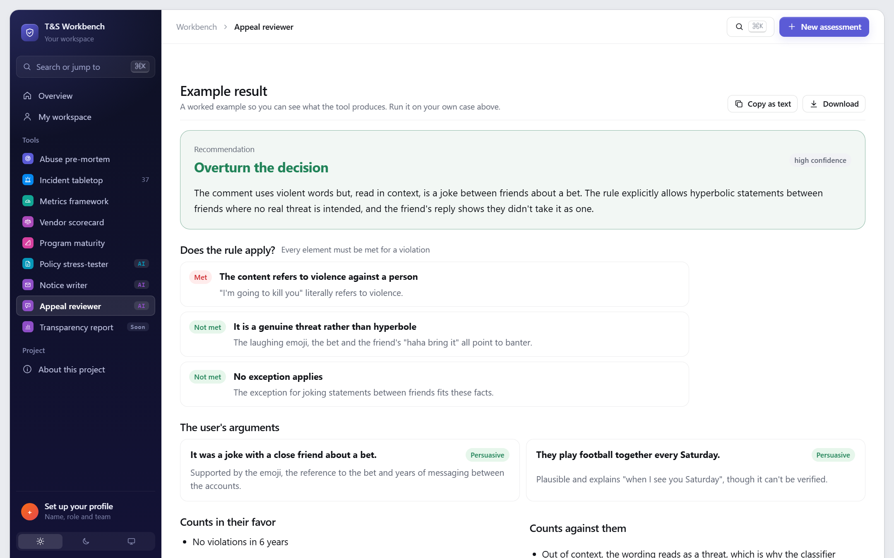
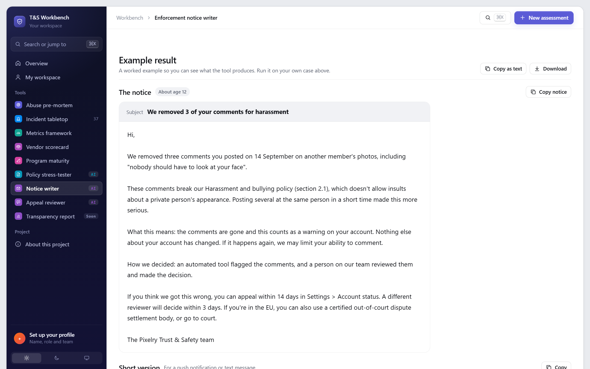
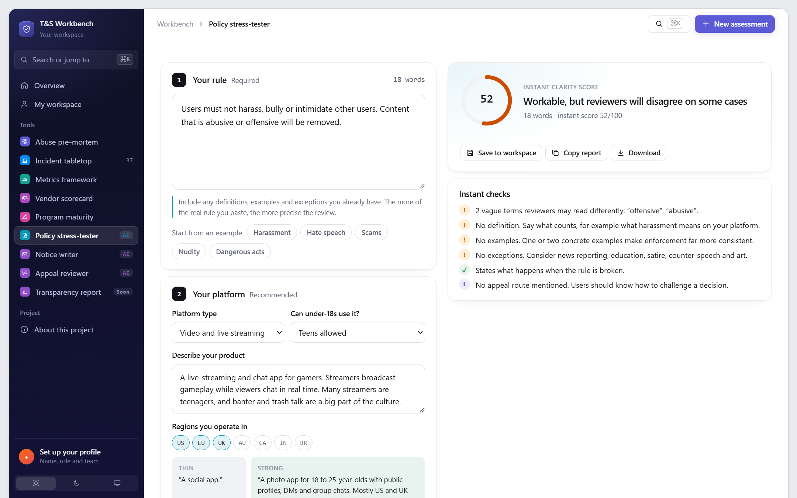

# T&S AI Assistants

> **Can AI take the first pass on the writing-heavy parts of Trust & Safety work, safely?**

Three assistants for policy and enforcement work: stress-test a rule, write an enforcement notice, and get a second opinion on an appeal. A fourth, a transparency report drafter, is under construction. They run on the user's own Claude account, only when they click, and a person always makes the final call.

**[Policy stress-tester](https://stevenmacchia.github.io/ts-workbench/#policy)** · **[Enforcement notice writer](https://stevenmacchia.github.io/ts-workbench/#notice)** · **[Appeal reviewer](https://stevenmacchia.github.io/ts-workbench/#appeal)** · part of [T&S Workbench](https://github.com/stevenmacchia/ts-workbench) · free, no sign-up

## The problem

Policy, enforcement and reporting work is writing-heavy and repetitive, and quality varies with whoever is on shift. Generic chatbots help, but they invent facts, skip legal requirements and can't be trusted with a decision.

## How it works

1. **Structured inputs.** Each assistant asks for exactly what a senior reviewer would need, with examples of good input.
2. **A constrained prompt.** JSON-only output, explicit rules against inventing facts or figures, and legal requirements spelled out.
3. **Validated, human-owned output.** Every field is checked before display, and each result is framed for a person to review and decide.

## What's in this repo

The tool's knowledge, published as open content you can read, reuse and adapt.

| File | What it is |
|---|---|
| [`prompts/policy-stress-tester.md`](prompts/policy-stress-tester.md) | Finds vague terms, gaps and eight hard edge cases, with a clearer rewrite |
| [`prompts/enforcement-notice-writer.md`](prompts/enforcement-notice-writer.md) | Drafts a notice checked against what an EU statement of reasons must include |
| [`prompts/appeal-reviewer.md`](prompts/appeal-reviewer.md) | Tests each element of the rule against the facts and weighs the user's arguments |

## Use it for

- Policy launches and rewrites
- Enforcement and appeals operations
- Writing notices that meet EU statement of reasons rules

## More screenshots

## How the AI is used

- **No server and no API key.** Requests run on the visitor's own Claude account through the page, only after they click, so the tools stay free to offer.
- **Private by design.** Inputs stay in the visitor's browser, and every form asks people to leave out personal data.
- **Fails safely.** Declined permission, rate limits and malformed output are all handled, and every tool includes a worked example result for people who can't run it.

## License and credit

Content in this repo is licensed [CC BY 4.0](LICENSE): reuse and adapt it freely, with credit. The tool's source code is in [ts-workbench](https://github.com/stevenmacchia/ts-workbench) under the MIT license.

Built by [Steven Macchia](https://www.linkedin.com/in/stevenmacchia), Trust & Safety leader, with AI-assisted development (Claude).
